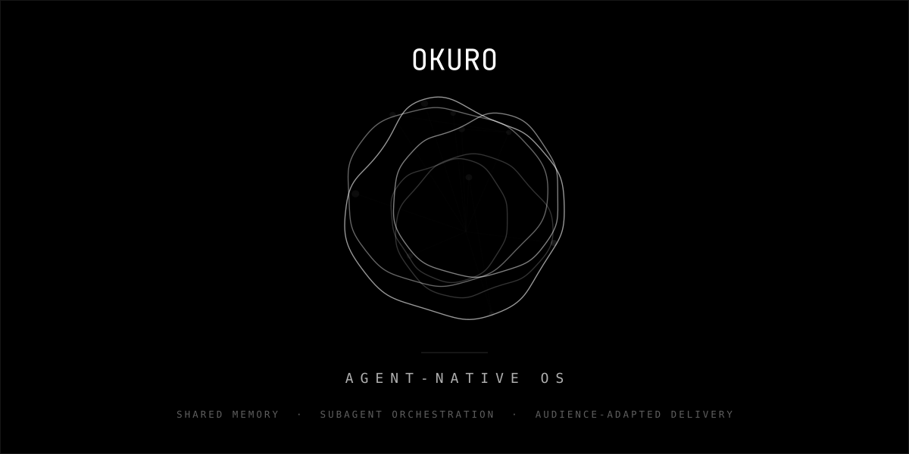

> **This is a generated repository.** It is exported from a private
> development tree by an automated release pipeline; its history is
> append-only (one commit per release) and pull requests are not
> accepted — they would be destroyed by the next export.
> Bug reports and feature requests are welcome as **issues**.

<p align="center">
  
</p>

<p align="center">
  <sub><code>ALPHA · v3.0.0</code> &nbsp;·&nbsp; <code>LINUX · MACOS · WINDOWS</code> &nbsp;·&nbsp; <code>APACHE-2.0</code> &nbsp;·&nbsp; <code>CLAUDE CODE · CODEX · GEMINI · CURSOR</code></sub>
</p>

<p align="center">
  A single package that wires your CLI AI tools into a shared brain via MCP —<br>
  then adds the primitives most agent stacks skip.
</p>

<br>

A shared brain for your CLI-based AI tools (Claude Code, Codex, Gemini, Cursor) over MCP — with the primitives most agent stacks omit: behavioral profile sliders that drive document **structure**, a PII-firewalled translation layer for per-recipient adaptation, and a three-streams handover model that keeps agent context, user reports, and recipient deliveries separate.

## What's different

Most agent ecosystems pick one slice. Okuro bundles the slices that have to talk to each other:

| Primitive | What it is | Why it matters |
|---|---|---|
| **Cognitive sliders** | 8-axis behavioral profile per person — info_depth, decision_framing, lead_with, jargon, format, pace, time_horizon, risk_framing | Drives document **structure** deterministically — slide count, options-vs-recommendation, TLDR-first. Not a tone hint; a structural transform you can read off the schema. |
| **PII firewall** | `cognitive_profile_for_llm()` strips names, emails, orgs, contact info before any prompt | The LLM sees *how* to talk to a recipient, never *who* they are. Privacy-preserving translation as a primitive, not a feature flag. |
| **Three Streams** | A: agent→agent (structured refs, no inlined source). B: agent→UI (report artifact). C: agent→recipient (adapted render). Each its own table, validators, channel. | No "first 40 lines of someone else's report" as agent context. Each consumer gets the shape they need. |
| **Audience-adapted delivery** | 5-stage pipeline: SourceDocument → outline_for_recipient → tokens_to_theme → channel.render → persist. Channels: markdown, Marp PDF, Astro+Tailwind microsite. | Same artifact, recipient-shaped output. Marketing tools do this at scale; okuro does it as an agent primitive bound to your personal CRM. |
| **Behavioral middleware** | Per-tool-call rule prefix + bootstrap hard-gate + episodic nudge stack at the MCP layer | Compliance built for personal attention management, not enterprise audit. AuDHD-first by design. |
| **Multi-CLI** | One shared brain across Claude Code / Codex / Gemini / Cursor / Antigravity | Switch CLIs mid-session, keep the context. |

### What it isn't

- **Not a chat UI.** OpenClaw owns that surface. Okuro is the backend — pair them.
- **Not enterprise.** Single-user, local-first, no SSO, no SOC 2.
- **Not a memory drop-in.** Mem0 / Letta / MemPalace plug into your agent. Okuro **is** the agent context fabric — your CLIs plug into it.

## Recent milestones

- **okuro·flow** — a native node-graph canvas at `/flow`: design agent/data flows visually, backed by a SQLite store with REST + SSE live-sync and MCP tools so agents can edit flows too. Flow ↔ Mermaid view toggle; full design-system theming.
- **Orchestrator convergence + review loop** — one session-loop pipeline with an adversarial reviewer (deterministic acceptance-criteria pre-check; round + verdict surfaced per subtask), review-completion so correct work reaches *done* instead of just escalating, and a clarity-triggered smart gate that auto-routes ambiguous tasks to multi-role deliberation. Plus autonomous task creation.
- **Knowledge graph** — one filterable view over everything agents learn, think, decide, and deliver (memory · thoughts · artifacts · progress · KG), with Gallery / Table / Graph / Timeline lenses.
- **Relational CRM** — people, companies, affiliations, connections, and engagements as first-class entities feeding the audience-adapted delivery layer.
- **Cortex code intelligence** — AST-aware (cAST) chunking + a code-graph ingestor for semantic search over your codebases, with a weekly self-heal reclaim.
- **Reliability & install** — pre-migration DB snapshots with atomic apply, a report-only `doctor` + explicit `okuro migrate`, one-command install that builds the desktop UI, and laptop-safe embedding-tier auto-selection.

## Install

### Linux / macOS

One line, zero prerequisites — it installs the toolchain (git, Python 3.12, Node; on macOS the Command Line Tools and Homebrew first), clones okuro into `~/okuro-ai`, and runs the installer:

```bash
bash -c "$(curl -fsSL https://raw.githubusercontent.com/saxmode/okuro-ai/main/bootstrap.sh)"
```

Already have git and Python 3.11+? Clone and run one script:

```bash
git clone https://github.com/saxmode/okuro-ai.git
cd okuro-ai
./install.sh
```

That's it. `install.sh` picks the newest Python 3.11+ on your PATH, creates a local `./.venv`, installs okuro in editable mode (including the embed extras for semantic search), and launches the wizard. The wizard opens at `http://127.0.0.1:13335/onboarding` (a transient port — the persistent dashboard runs on `13333` once onboarding completes). On subsequent runs, `okuro` (from `./.venv/bin/okuro`) opens the dashboard directly on `13333`.

Public repo, no auth required.

### Windows

On native Windows, use the PowerShell installers (no WSL required):

```powershell
# zero-to-running: installs the toolchain via winget, then okuro
irm https://raw.githubusercontent.com/saxmode/okuro-ai/main/bootstrap.ps1 | iex

# or, from a clone:
git clone https://github.com/saxmode/okuro-ai.git
cd okuro-ai
powershell -ExecutionPolicy Bypass -File .\install.ps1
```

`bootstrap.ps1` ensures Git, Python 3.12, Node.js, and the Edge **WebView2 runtime** (the dashboard's renderer) via `winget`, then hands off to `install.ps1`, which creates `.\.venv`, installs okuro, builds the UI, and launches the wizard. Background services install as per-user **Task Scheduler** tasks — no admin required. The orchestrator and daemon run in your interactive session (they spawn the AI CLIs, which need your logged-in credentials); the embedding service survives logout. `.\install.ps1 -Check` is available via `bootstrap.ps1 -Check` to inspect the toolchain without changing anything.

## Update

Re-run the same command you installed with. Both detect an existing install and update it in place — pull, rebuild only what changed, migrate the database, restart the services, verify:

```bash
# Linux / macOS — either of these
bash -c "$(curl -fsSL https://raw.githubusercontent.com/saxmode/okuro-ai/main/bootstrap.sh)"
cd ~/okuro-ai && ./install.sh

# Windows
irm https://raw.githubusercontent.com/saxmode/okuro-ai/main/bootstrap.ps1 | iex
```

A full backup of your database and keyring is taken before anything changes (`okuro backup list` to see them, `okuro backup restore latest` to roll back). Your data lives in `~/.okuro`, never in the checkout.

If a release replaces the repository's history, the updater notices (the fetched branch shares no history with your checkout), backs up, re-clones beside the old directory, swaps the two, and finishes the install on the new code. The old checkout is kept as `~/okuro-ai.old-<timestamp>` for you to delete once the new one checks out.

## Prerequisites

- **Python 3.11+**
  - macOS: `brew install python@3.12`
  - Ubuntu: `sudo apt install python3.12 python3.12-venv`
  - Windows: `winget install Python.Python.3.12` (or let `bootstrap.ps1` do it)
- **Node 18+** (for installing the Claude Code / Codex / Gemini CLIs — step 1 of the wizard detects this and offers to install if missing)
  - macOS: `brew install node`
  - Ubuntu: `sudo apt install nodejs npm`
  - Windows: `winget install OpenJS.NodeJS`
- **Windows only — Edge WebView2 runtime** (the desktop dashboard's renderer): `winget install Microsoft.EdgeWebView2Runtime` (preinstalled on Windows 11; `bootstrap.ps1` ensures it)
- A browser. If you're on SSH or a headless box, run `./install.sh init --no-browser` and tunnel the port back.

## First run — what happens

The wizard has 9 steps (all skippable except the first two):

| Step | What it does |
|------|--------------|
| **Connect an AI assistant** | Detects Claude Code / Codex / Gemini. Click *Install* and okuro opens a terminal in your desktop session with the right `npm install` command; click *Sign in* to do the same for auth. You can skip to the next step once one CLI is authenticated. |
| **Who are you?** | Name, handle, timezone. |
| Import your profile | Optional: scrape LinkedIn / GitHub / a URL into your profile. |
| Communication | How agents should talk to you — format, tone, verbosity. |
| Cognitive style | Neurotype, pattern preferences, hyperfocus vs breadth. |
| Principles | Decision principles that should guide agent choices. |
| Boundaries | What agents can do autonomously vs ask-first. |
| Secrets vault | Encrypted local store for API keys and secrets. |
| Visual identity | Design profile for generated UI. Ships with one neutral baseline. |

When you click **Done**, okuro stamps completion, installs the background orchestrator and daemon as user-level services (systemd on Linux — linger is auto-enabled so they survive logout; launchd on macOS), and from then on `okuro` opens the dashboard.

## What you get

| Capability | How |
|------------|-----|
| Shared memory across CLIs | MCP server registered with every detected AI CLI |
| Semantic codebase search | cortex — indexes any directory with `okuro search` (requires an `embed-*` extra; see below) |
| 57 expert roles | `okuro roles match "my task"` picks the best system-prompt |
| System state | `okuro system`, `okuro gpu`, `okuro doctor` |
| Background orchestration | daemon runs hygiene, reminders, scheduled tasks |
| Web dashboard | `okuro dashboard` (or just `okuro` after setup) |

## CLI cheatsheet

Run these via `./venv/bin/okuro ...` or activate the venv first (`source venv/bin/activate`).

```bash
okuro                     # web app (wizard on first run, dashboard after)
okuro init                # force the wizard
okuro init --cli          # text-mode wizard (no browser)
okuro init --non-interactive   # unattended install
okuro init --no-browser   # web wizard, print URL (SSH/tunneling)
okuro dashboard           # skip first-run check, go straight to dashboard
okuro doctor              # health check
okuro service list        # orchestrator/daemon/embed state
okuro --help              # all subcommands
```

## Semantic search (optional, recommended)

Cortex — okuro's codebase semantic search — runs on `sentence-transformers` with a local embedding model. The base install deliberately leaves it out (~30 MB footprint instead of ~2 GB with torch). Enable it with the extra that matches your hardware:

```bash
./venv/bin/pip install -e '.[embed-cuda]'  --index-url https://download.pytorch.org/whl/cu121   # NVIDIA
./venv/bin/pip install -e '.[embed-rocm]'  --index-url https://download.pytorch.org/whl/rocm6.0  # AMD
./venv/bin/pip install -e '.[embed-cpu]'   --index-url https://download.pytorch.org/whl/cpu     # CPU
./venv/bin/pip install -e '.[embed-apple]'                                                        # macOS arm64 (MPS)
```

Without it, `cortex_search` degrades gracefully to a lexical path (and tells you how to fix it).

Other extras:

```bash
./venv/bin/pip install -e '.[profile]'    # LinkedIn PDF parsing for onboarding
./venv/bin/pip install -e '.[browser]'    # Playwright for URL scraping + visual review
```

## Environment variables

| Var | Effect |
|-----|--------|
| `OKURO_REPO_ROOT` | Root of the project you want okuro to watch (default: cwd) |
| `OKURO_PROJECT_ROOTS` | `:`-separated prefixes under `$HOME` for project-path inference |
| `OKURO_NOTES_DIR` | Absolute path to an Obsidian vault if you want note-bridge signals |
| `OKURO_MCP_TRANSPORT` | `stdio` (default), `http`, or `auto` |

## Troubleshooting

**Port 13335 (wizard) or 13333 (dashboard) is taken.** `okuro init --port 14000` (or any free port). `okuro` automatically picks a free port in 13336–13399 when 13335 is busy. Reserved okuro ports: `13333` orchestrator API + SPA, `13334` embedding service, `13335` onboarding wizard. The wizard's free-port picker skips `13333` and `13334` so it can never collide with a persistent service.

**Running over SSH / no DISPLAY.** `okuro init --no-browser`, then on your laptop: `ssh -L 13335:127.0.0.1:13335 <host>` and open `http://127.0.0.1:13335/onboarding`. After onboarding, tunnel `13333` for the dashboard.

**Step 1 says "installed but not authenticated".** Click *Sign in* on that row — okuro will open a terminal running the CLI's login command (e.g. `claude /login`).

**Step 1 says "no terminal emulator found".** okuro tries gnome-terminal, konsole, kitty, alacritty, tilix, xfce4-terminal, and xterm. If none are installed it falls back to a copy-to-clipboard command — run it in your own terminal, then click *Re-check*.

**`okuro doctor` reports missing components.** Re-run `okuro init` to repair. Each step is idempotent.

**Uninstall.**

```bash
./venv/bin/okuro uninstall          # interactive, walks you through it
./venv/bin/okuro uninstall --dry-run   # preview without changing anything
./venv/bin/okuro uninstall --keep-data  # remove services / MCP / linger but keep ~/.okuro
./venv/bin/okuro uninstall --yes    # non-interactive (CI)
```

`uninstall` removes systemd / launchd units, MCP entries from `~/.claude/`, `~/.codex/`, `~/.gemini/`, `~/.cursor/`, `~/.okuro/TOOL-PROTOCOL.md`, and (with confirmation) `~/.okuro/`.

Files it does **not** touch automatically — review and clean these by hand if you want a complete removal:

- `~/.claude/CLAUDE.md`, `~/.codex/AGENTS.md`, `~/.gemini/GEMINI.md`, `~/.cursor/rules/okuro.mdc` — these may contain user edits, so they're listed during uninstall and left in place.
- OS keychain entries holding the keyring master password (macOS Keychain, Linux Secret Service / libsecret).
- Any background `okuro init` uvicorn that's still running because the wizard is open in a browser tab.

Then `pip uninstall okuro` removes the package itself. Delete the cloned repo directory last.

## Test loop (install → test → reset → reinstall)

For iterating on a Mac or any clean box:

```bash
git clone https://github.com/saxmode/okuro-ai.git && cd okuro-ai
./install.sh                         # wizard opens at /onboarding-preview
# ... walk it, find issues ...
./venv/bin/okuro uninstall --yes     # nuke services, MCP registrations, linger, ~/.okuro
git pull                             # get fixes
./install.sh                         # round 2
```

The uninstall command is idempotent — running it twice on a clean box is a no-op.

## Security & privacy

Okuro is a single-user, local-first tool that stores genuinely sensitive data — your cognitive profile, personal thoughts, work-in-progress, the contents of your agent conversations. It relies on **OS file permissions and your full-disk encryption**, not application-level encryption. Anything an agent reads from okuro travels to whatever AI provider that agent is connected to (Anthropic, OpenAI, Google, etc.); okuro does not redact or filter what gets sent.

Read [`SECURITY.md`](SECURITY.md) for the full threat model, the user-responsibility checklist (FDE, gitignore `~/.okuro/`, configure provider no-train settings), and what is out of scope by design.

## License

MIT. See `LICENSE`.
