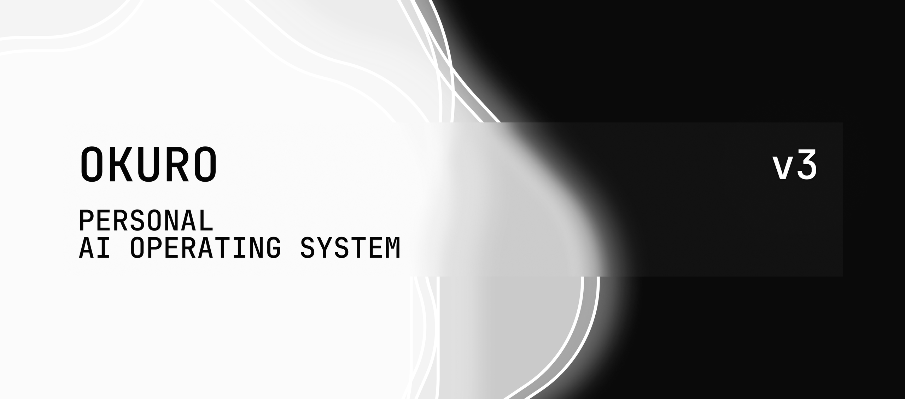

> **This is a generated repository.** It is exported from a private
> development tree by an automated release pipeline; its history is
> append-only (one commit per release) and pull requests are not
> accepted — they would be destroyed by the next export.
> Bug reports and feature requests are welcome as **issues**.

<p align="center">
  
</p>

<p align="center">
  <sub><code>ALPHA · v3.1.1</code> &nbsp;·&nbsp; <code>LINUX · MACOS · WINDOWS</code> &nbsp;·&nbsp; <code>APACHE-2.0</code> &nbsp;·&nbsp; <code>CLAUDE CODE · CODEX · GEMINI · CURSOR</code></sub>
</p>

<h3 align="center">One memory for all your AI assistants.</h3>

<p align="center">
  Okuro remembers who you are, how you work and what you've done —<br>
  so you never explain yourself to an AI twice.
</p>

<br>

## What is okuro?

You probably use more than one AI assistant — Claude Code, Codex, Gemini, Cursor. Each one starts every conversation knowing nothing about you.

Okuro sits underneath all of them and gives them **one shared brain**:

- **It knows you.** How you like answers (short or detailed, options or a recommendation), what you're good at, what an assistant may do on its own and what it must ask first.
- **It remembers.** What every past session learned, decided or got wrong is there for the next one — whichever assistant it runs in.
- **It does the work.** Hand it a bigger job; it breaks it into steps, runs them, has the result reviewed, and asks you only where a decision is really yours.

It runs on your own computer. Your data stays in one folder on your machine (`~/.okuro`).

## What it can do

| Area | What you get |
|---|---|
| **Memory** | Everything assistants learn is saved and found again by meaning, not just keywords — including your own code. |
| **Your profile** | A short setup wizard captures how you think and communicate. Every assistant reads it before it answers you. |
| **Experts on call** | 97 built-in expert roles (designer, security reviewer, writer, architect …). Okuro picks the right one for each task. |
| **Bigger jobs** | Describe a goal; okuro plans it, runs the steps in parallel, reviews the result and shows you a preview. |
| **Planning** | Gantt charts, a workflow drawer and a flow canvas — draw a process, then let okuro run it. |
| **Writing & notes** | A notes app with dictation, comments directly on pages and decks, and one inbox for todos, signals and reminders. |
| **People** | A simple contact book (people, companies, connections) so okuro can tailor a document to the person who reads it. |
| **Output** | Slide decks, documents, websites and two-voice audio summaries — shaped for the person who will read or hear them. |
| **Local AI** *(needs a GPU)* | Finds, downloads and runs open-source models on your own hardware, and tells you when a better one comes out. |
| **Dashboard** | A web app on your machine to see and steer all of the above — on desktop and phone. |

## What makes it different

| Usually | With okuro |
|---|---|
| Each AI tool has its own memory — or none. | **One memory for every tool.** Switch from Claude to Codex mid-task and keep the context. |
| You re-explain your project in every chat. | **Context arrives on its own.** Each session starts with what the last one learned. |
| "Personalisation" means a tone setting. | **Your profile changes the shape of the answer** — length, structure, options vs. a recommendation. |
| Documents are written once, for everyone. | **Written for the reader.** The same content becomes a short summary for one person and a deep dive for another. |
| Personal details get pasted into prompts. | **A privacy filter.** The AI learns *how* to write for someone, never *who* they are. |
| Agents act first and explain later. | **You decide what's yours to decide.** Each question comes with a recommended answer; nothing becomes a rule without your OK. |
| Locked to one vendor. | **No lock-in.** If a provider gets worse or pricier, switch — your brain stays. |

**What it isn't:** not a chat app, not built for teams or enterprises (single user, local-first), and not a plug-in memory for one assistant — it is the layer all your assistants plug into.

## What's new in 3.1

Okuro 3.1 is the biggest update so far — the dashboard was rebuilt from the ground up.

- **A new dashboard.** Five clear sections instead of 23 loose links; every page and tab has its own address you can bookmark; light and dark mode; works on a phone.
- **New pages.** Notes, Inbox, Chat, Comments on pages and decks, Projects, Workflows, a Knowledge graph and Lessons.
- **Smarter jobs.** Every question okuro asks you comes with a recommended answer; crashed jobs pick up where they stopped; jobs can run on Claude, Codex or OpenAI.
- **Better output.** Decks built for a specific reader, a slide editor with PowerPoint export, and podcast-style audio summaries.
- **Safer updates.** A backup before every update, a stop on any error, and one command to roll back.

## Install

**Linux / macOS** — one line, nothing to install first:

```bash
bash -c "$(curl -fsSL https://raw.githubusercontent.com/saxmode/okuro-ai/main/bootstrap.sh)"
```

**Windows** — in PowerShell (no WSL needed):

```powershell
irm https://raw.githubusercontent.com/saxmode/okuro-ai/main/bootstrap.ps1 | iex
```

A setup wizard opens in your browser. It connects your AI assistant, asks a few questions about you, and you're done. After that, type `okuro` to open the dashboard.

**You need:** at least one AI assistant you can sign in to (Claude Code, Codex or Gemini). The wizard installs it for you if it's missing.

## Update

Run the same install command again. Okuro backs up your data first, updates, and checks that everything works. Something wrong? `okuro backup restore latest` takes you back.

## Privacy

Okuro stores everything on your own machine and relies on your computer's disk encryption. Whatever an assistant reads from okuro goes to that assistant's provider (Anthropic, OpenAI, Google …) — okuro does not filter it. Details: [`SECURITY.md`](SECURITY.md).

---

## For developers

<details>
<summary><b>Install from a clone</b></summary>

Already have git and Python 3.11+? Clone and run one script:

```bash
git clone https://github.com/saxmode/okuro-ai.git
cd okuro-ai
./install.sh
```

`install.sh` picks the newest Python 3.11+ on your PATH, creates a local `./.venv`, installs okuro in editable mode (including the embed extras for semantic search), and launches the wizard. The wizard opens at `http://127.0.0.1:13335/onboarding` (a transient port — the persistent dashboard runs on `13333` once onboarding completes). On subsequent runs, `okuro` (from `./.venv/bin/okuro`) opens the dashboard directly on `13333`.

Windows, from a clone:

```powershell
git clone https://github.com/saxmode/okuro-ai.git
cd okuro-ai
powershell -ExecutionPolicy Bypass -File .\install.ps1
```

`bootstrap.ps1` ensures Git, Python 3.12, Node.js, and the Edge **WebView2 runtime** (the dashboard's renderer) via `winget`, then hands off to `install.ps1`, which creates `.\.venv`, installs okuro, builds the UI, and launches the wizard. Background services install as per-user **Task Scheduler** tasks — no admin required. The orchestrator and daemon run in your interactive session (they spawn the AI CLIs, which need your logged-in credentials); the embedding service survives logout. `.\install.ps1 -Check` is available via `bootstrap.ps1 -Check` to inspect the toolchain without changing anything.

</details>

<details>
<summary><b>Prerequisites</b></summary>

- **Python 3.11+**
  - macOS: `brew install python@3.12`
  - Ubuntu: `sudo apt install python3.12 python3.12-venv`
  - Windows: `winget install Python.Python.3.12` (or let `bootstrap.ps1` do it)
- **Node 18+** (for installing the Claude Code / Codex / Gemini CLIs — step 1 of the wizard detects this and offers to install if missing)
  - macOS: `brew install node`
  - Ubuntu: `sudo apt install nodejs npm`
  - Windows: `winget install OpenJS.NodeJS`
- **Windows only — Edge WebView2 runtime** (the desktop dashboard's renderer): `winget install Microsoft.EdgeWebView2Runtime` (preinstalled on Windows 11; `bootstrap.ps1` ensures it)
- A browser. If you're on SSH or a headless box, run `./install.sh init --no-browser` and tunnel the port back.

</details>

<details>
<summary><b>First run — the wizard step by step</b></summary>

The wizard has 9 steps (all skippable except the first two):

| Step | What it does |
|------|--------------|
| **Connect an AI assistant** | Detects Claude Code / Codex / Gemini. Click *Install* and okuro opens a terminal in your desktop session with the right `npm install` command; click *Sign in* to do the same for auth. You can skip to the next step once one CLI is authenticated. |
| **Who are you?** | Name, handle, timezone. |
| Import your profile | Optional: scrape LinkedIn / GitHub / a URL into your profile. |
| Communication | How agents should talk to you — format, tone, verbosity. |
| Cognitive style | Neurotype, pattern preferences, hyperfocus vs breadth. |
| Principles | Decision principles that should guide agent choices. |
| Boundaries | What agents can do autonomously vs ask-first. |
| Secrets vault | Encrypted local store for API keys and secrets. |
| Visual identity | Design profile for generated UI. Ships with one neutral baseline. |

When you click **Done**, okuro stamps completion, installs the background orchestrator and daemon as user-level services (systemd on Linux — linger is auto-enabled so they survive logout; launchd on macOS), and from then on `okuro` opens the dashboard.

</details>

<details>
<summary><b>How it works under the hood</b></summary>

Okuro is an MCP server registered with every detected AI CLI, backed by a local SQLite brain (`~/.okuro/okuro.db`), plus three background services: an orchestrator (API + dashboard), a daemon (hygiene, reminders, scheduled jobs) and an embedding service (semantic search).

| Building block | What it is |
|---|---|
| **Cognitive sliders** | An 8-axis behavioural profile per person (info depth, decision framing, lead-with, jargon, format, pace, time horizon, risk framing) that drives document **structure** — slide count, options vs. recommendation, TL;DR first. |
| **PII firewall** | `cognitive_profile_for_llm()` strips names, emails, organisations and contact details before any prompt. |
| **Three streams** | Agent→agent handovers (structured refs), agent→you reports, agent→recipient deliveries — each its own table, validators and channel. |
| **Audience-adapted delivery** | SourceDocument → outline for recipient → theme tokens → channel render (markdown, PDF, microsite) → persist. |
| **Behavioural middleware** | A per-tool-call rule prefix, a bootstrap gate and nudges at the MCP layer keep every assistant on your contract. |
| **Cortex** | AST-aware code chunking and a code graph for semantic search over your repositories. |

</details>

<details>
<summary><b>Feature switches</b></summary>

Occasionally a surface ships before it is ready to be presented, and arrives switched off. `okuro features` lists every switch on your install, whether it is on, what it is holding back, and where that came from.

When something is listed, turn it on in `~/.okuro/config.yaml`:

```yaml
features:
  <name>: true
```

Then restart okuro, or just reload the page for a web-only surface. Anything `okuro features` does not list is not gated — it is simply on.

**`transcript-analysis` — ships off.** Turned on, okuro copies the transcripts your agent CLIs write (Claude Code, Codex, Gemini, antigravity) into its own database, then mines them on a schedule for behaviour findings and review-ready lessons: nine daemon jobs, the `okuro trace` and `okuro distill` commands, the trace and transcript MCP tools, and the Lessons page. It reads your own machine and spends your own model budget doing it, so it is yours to switch on:

```yaml
features:
  transcript-analysis: true
```

Turning it back off stops the jobs and **deletes nothing** — everything already ingested stays, and turning it on again resumes against it. A job held back this way shows as *feature off* on the Scheduled page rather than disappearing.

</details>

<details>
<summary><b>Updating — what happens in detail</b></summary>

Both install commands detect an existing install and update it in place — pull, rebuild only what changed, migrate the database, restart the services, verify:

```bash
# Linux / macOS — either of these
bash -c "$(curl -fsSL https://raw.githubusercontent.com/saxmode/okuro-ai/main/bootstrap.sh)"
cd ~/okuro-ai && ./install.sh

# Windows
irm https://raw.githubusercontent.com/saxmode/okuro-ai/main/bootstrap.ps1 | iex
```

A full backup of your database and keyring is taken before anything changes (`okuro backup list` to see them, `okuro backup restore latest` to roll back). Your data lives in `~/.okuro`, never in the checkout.

If a release replaces the repository's history, the updater notices (the fetched branch shares no history with your checkout), backs up, re-clones beside the old directory, swaps the two, and finishes the install on the new code. The old checkout is kept as `~/okuro-ai.old-<timestamp>` for you to delete once the new one checks out.

</details>

<details>
<summary><b>CLI cheatsheet</b></summary>

Run these via `./.venv/bin/okuro ...` or activate the venv first (`source .venv/bin/activate`).

```bash
okuro                     # web app (wizard on first run, dashboard after)
okuro init                # force the wizard
okuro init --cli          # text-mode wizard (no browser)
okuro init --non-interactive   # unattended install
okuro init --no-browser   # web wizard, print URL (SSH/tunneling)
okuro dashboard           # skip first-run check, go straight to dashboard
okuro doctor              # health check
okuro service list        # orchestrator/daemon/embed state
okuro --help              # all subcommands
```

</details>

<details>
<summary><b>Semantic search and other extras</b></summary>

Cortex — okuro's codebase semantic search — runs on `sentence-transformers` with a local embedding model. Enable it with the extra that matches your hardware:

```bash
./.venv/bin/pip install -e '.[embed-cuda]'  --index-url https://download.pytorch.org/whl/cu121   # NVIDIA
./.venv/bin/pip install -e '.[embed-rocm]'  --index-url https://download.pytorch.org/whl/rocm6.0  # AMD
./.venv/bin/pip install -e '.[embed-cpu]'   --index-url https://download.pytorch.org/whl/cpu     # CPU
./.venv/bin/pip install -e '.[embed-apple]'                                                        # macOS arm64 (MPS)
```

Without it, `cortex_search` degrades gracefully to a lexical path (and tells you how to fix it).

Other extras:

```bash
./.venv/bin/pip install -e '.[profile]'    # LinkedIn PDF parsing for onboarding
./.venv/bin/pip install -e '.[browser]'    # Playwright for URL scraping + visual review
```

</details>

<details>
<summary><b>Environment variables</b></summary>

| Var | Effect |
|-----|--------|
| `OKURO_REPO_ROOT` | Root of the project you want okuro to watch (default: cwd) |
| `OKURO_PROJECT_ROOTS` | `:`-separated prefixes under `$HOME` for project-path inference |
| `OKURO_NOTES_DIR` | Absolute path to an Obsidian vault if you want note-bridge signals |
| `OKURO_MCP_TRANSPORT` | `stdio` (default), `http`, or `auto` |

</details>

<details>
<summary><b>Troubleshooting</b></summary>

**Port 13335 (wizard) or 13333 (dashboard) is taken.** `okuro init --port 14000` (or any free port). `okuro` automatically picks a free port in 13336–13399 when 13335 is busy. Reserved okuro ports: `13333` orchestrator API + SPA, `13334` embedding service, `13335` onboarding wizard. The wizard's free-port picker skips `13333` and `13334` so it can never collide with a persistent service.

**Running over SSH / no DISPLAY.** `okuro init --no-browser`, then on your laptop: `ssh -L 13335:127.0.0.1:13335 <host>` and open `http://127.0.0.1:13335/onboarding`. After onboarding, tunnel `13333` for the dashboard.

**Step 1 says "installed but not authenticated".** Click *Sign in* on that row — okuro will open a terminal running the CLI's login command (e.g. `claude /login`).

**Step 1 says "no terminal emulator found".** okuro tries gnome-terminal, konsole, kitty, alacritty, tilix, xfce4-terminal, and xterm. If none are installed it falls back to a copy-to-clipboard command — run it in your own terminal, then click *Re-check*.

**`okuro doctor` reports missing components.** Re-run `okuro init` to repair. Each step is idempotent.

</details>

<details>
<summary><b>Uninstall</b></summary>

```bash
./.venv/bin/okuro uninstall          # interactive, walks you through it
./.venv/bin/okuro uninstall --dry-run   # preview without changing anything
./.venv/bin/okuro uninstall --keep-data  # remove services / MCP / linger but keep ~/.okuro
./.venv/bin/okuro uninstall --yes    # non-interactive (CI)
```

`uninstall` removes systemd / launchd units, MCP entries from `~/.claude/`, `~/.codex/`, `~/.gemini/`, `~/.cursor/`, and (with confirmation) `~/.okuro/`. Instruction files are listed for review rather than deleted.

Files it does **not** touch automatically — review and clean these by hand if you want a complete removal:

- `~/.claude/CLAUDE.md`, `~/.codex/AGENTS.md`, `~/.gemini/GEMINI.md`, `~/.cursor/rules/okuro.mdc` — these may contain user edits, so they're listed during uninstall and left in place.
- OS keychain entries holding the keyring master password (macOS Keychain, Linux Secret Service / libsecret).
- Any background `okuro init` uvicorn that's still running because the wizard is open in a browser tab.

Then `pip uninstall okuro` removes the package itself. Delete the cloned repo directory last.

</details>

<details>
<summary><b>Test loop (install → test → reset → reinstall)</b></summary>

For iterating on a Mac or any clean box:

```bash
git clone https://github.com/saxmode/okuro-ai.git && cd okuro-ai
./install.sh                         # wizard opens at /onboarding-preview
# ... walk it, find issues ...
./.venv/bin/okuro uninstall --yes    # nuke services, MCP registrations, linger, ~/.okuro
git pull                             # get fixes
./install.sh                         # round 2
```

The uninstall command is idempotent — running it twice on a clean box is a no-op.

</details>

## License

Apache-2.0. See [`LICENSE`](LICENSE) and [`NOTICE`](NOTICE).
